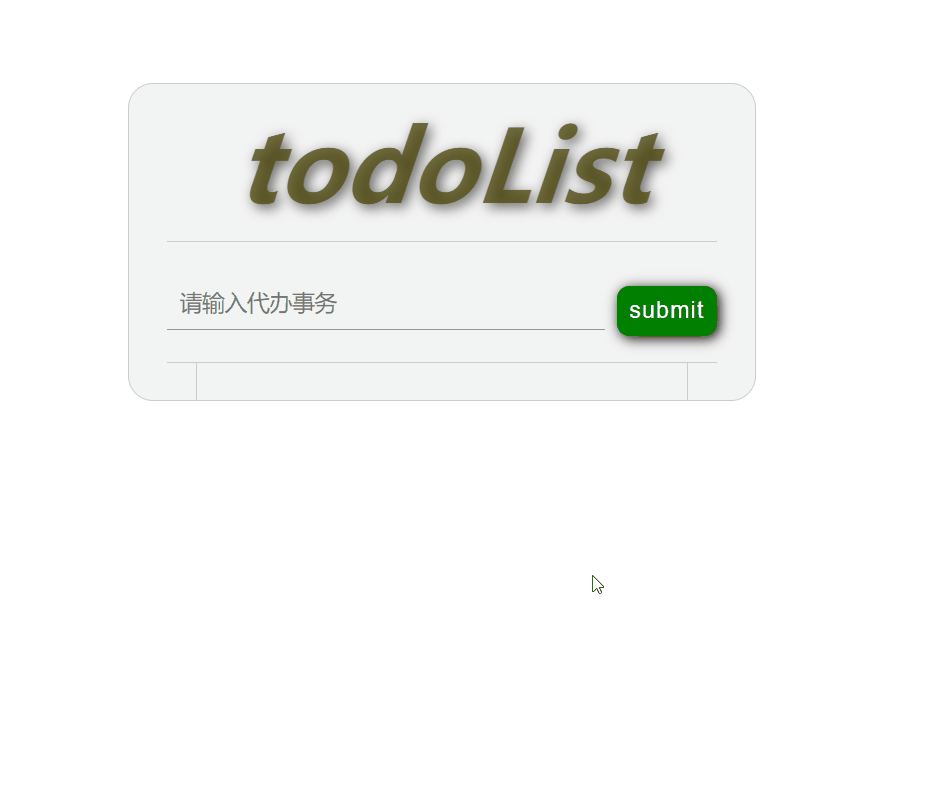
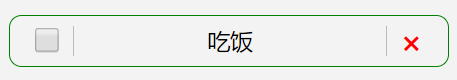

# React Hooks 实现 todoList 程序 
React Hooks 是 React 16.8及以上版本新增的功能。该功能可以让React函数组件与类组件一样具有状态和生命周期。这使得我们用简单的函数组件就可以完成复杂的逻辑操作。  
React Hooks 是一组简单的 API，这些API只能运行在函数组件当中，不能运行在类组件中。本程序主要用到了以下API：  
- `useState()` 管理状态的函数，返回一个数组。
- `useEffect()` 这个函数可以处理副作用。而且可以用这个函数来模拟类组件中的生命周期函数 —— `componentDidMount`、`componentDidUpdata`以及`componentWillUnmount`。
- `useRef()` 这个函数可以是我们在函数组件中获取DOM元素。
- `useContext()` 这个函数可以更好的在函数组件中使用`context`。
- `useCallback()` 这个函数类似于React当中的 `memo` 方法，使用它可以避免非必要渲染。  
以上就是完成该项目使用到的 `React Hooks` ，而React自身的比较重要的Hooks大概就是那么多，当然还有别的Hooks，而且你也可以自定义Hook。可以 **[参考官网](https://react.docschina.org/docs/hooks-reference.html)** 。  

## 项目最终程序
以下的动图就是最终的运行程序：  

  
## 项目初始化
这里用的是React脚手架工具：`create-react-app`，自动生成框架后就可以编写程序了。在命令行输入 `yarn start` 命令查看运行结果。  
### HTML结构
在 App.js 文件中，删除无用的代码。写入以下代码：
```js
import React from 'react';
import './App.css';

function TodoList(){
    return (
        <div className="wrapper">
            <h1>todoList</h1>
            <TodoBox />
            {/* TodoBox 用来盛放输入以及提交按钮 */}
            <List />
            {/* List 用来盛放任务列表 */}
        </div>
    );
}

function TodoBox(props){
    return (
        <form className="todo-form">
        <input ref={ipt} type="text" placeholder="请输入代办事务" />
        <button
            onClick={handleAddItem}
            type="submit"
        >submit</button>
    </form>
    );
}

function List(props){
    return (
        <ul>
            {/*
                这里渲染的每一项事务：<Item />
            */}
        </ul>
    );
}

function Item(props){       // 渲染列表
    return (
        <li className="todo-item">
        <input
            onChange={handleChange}
            type="checkbox"
        />
        <label>{info.item}</label>
        <span
            onClick={handleRemove}
            className="remove"
        >&#215;</span>
    </li>
    );
}

export default TodoList;
```
CSS 样式可以参考这个文件 —— **[CSS 样式](./src/App.css)**  
骨架搭建完毕下面开始编写逻辑代码。  
## Hooks 的几个 API 介绍
本文之介绍一下使用到的Hook，这几个也是很常用到的，特别是 `useState`、`useEffect`，下面一一介绍。  
### `useState` 
这个方法，可以使你能在函数组件中使用状态。它有一个参数：状态的初始值，并返回一个数组，这个数组有两个元素，分别是这个状态的变量名和操作这个状态的方法。用法如下：
```js
const [counter,setCounter] = useState(0);
```
注意这里的写法，看着有点怪，其实是用到了 ES6 中的解构赋值。这句话相当于：
```js
const counterAry = useState(0),
        counter = counterAry[0],
        setCounter = counterAry[1];
```
counter和setCounter变量名是可以随便取的。`useState(0)` 中的 0 就是将初始化 counter 的值为 0。  
#### setCounter（第二个元素）的用法：
在类组件中，我们不能使用setState直接改变state的值，在useState中也是如此。比如，我想让状态 counter 加 1，你不能这么干：
```js
setState({
    counter: counter ++
});
```
而应：
```js
setState({
    counter: counter + 1
});
```
setCounter 是一个方法，里面可以传入一个语句，但不可以直接改变 state。应该这么来写：
```js
setCounter(counter + 1);
```
以上就是 `useState()` API 的用法。接下来是 `useEffect`。  
## `useEffect()` 
该方法，比 `useState()` 方法能理解一些。可以将副作用编写到该方法当中，比如：异步请求、DOM事件。在React的类组建当中，常把副作用编写到 `componentDidMount` 和 `componentDidUpdata` 两个生命周期函数中。`componentDidMount` 表示组件已经挂载完毕，这个函数只会被调用一次在组件生命周期中，因此成为异步请求不错的发起位置。而 `componentDidUpdata` 函数在函数每次更新后几乎都会被调用（当然除了使用`shouldComponentUpdata` 或者 `memo`函数可能不会更新组件），因此使用该函数可以完成一些频繁的副作用操作，比如：DOM的滚动事件、窗口事件等使状态频繁被触发的情况肯能就会用到。  
那么在函数组件的Hook中又如何来实现呢？  
### `useEffect()` 函数模拟 `componentDidMount` 函数
`useEffect`函数接收两个参数，一个是 `callback` 另一个是个数组（可选）。这个数组很关键，它关系到前面的提到的生命周期函数的实现。先说第一个callback参数。这个参数就是为了处理副作用所设计的回调函数。在里面可以很好的处理副作用：
```js
useEffect(() => {
    axios.get('www.example.com/aaa?xxx').then((res) => {
        // ....
    });
});
```
第二个参数是个可选的参数，如果不写，则说明 **每次挂载以及更新操作都会被出发回调函数**。这也就相当于 `componentDidMount + componentDidUpdata` 。而如果填入一个空数组 (`[]`) 则表示你的 effect 不依赖于 props 或 state 中的任何值，所以它永远都不需要重复执行。（相当于只在 `componentDidMount` 中执行）。如果传入元素，必须传入的是 `state` 或 `props` 变量，意思就是只有当 state 或 props 值改变才会触发回调函数，这麽做可以避免不必要的重复渲染。  
以上就是对 `useEffect` 的整体介绍。  
## `useRef` 
`useRef` 方法可以很方便的才函数组件中获取DOM。它返回一个可变的 ref 对象，其 .current 属性被初始化为传入的参数（initialValue）。返回的 ref 对象在组件的整个生命周期内保持不变。  
#### 访问子组件：
```js
function Example(){
    const div = useRef();
    useEffect(() => {
        div.current.innerText = 'Hooks';
    },[]);
    return (
        <div ref={div}></div>
    );
}
```
在组件中ref值等于什么变量，在外部调用时变量名应一致，不然会报错。  
## `useContext` 
`useContext` 方法相当于类组建当中的 `static contextType = MyContext` 以及 `const context = this.context` 两个语句。或者早期的 `<Context.Consumer>`。使用 `useContext()` 函数使代码更加简洁。语法：
```js
const value = useContext(MyContext);
```
接收一个 context 对象（React.createContext 的返回值）并返回该 context 的当前值。当前的 context 值由上层组件中距离当前组件最近的 <MyContext.Provider> 的 value prop 决定。当然，前面的 `<Provider>` 和创建 `context` 方式并没有变，只是后面获取 value 值时更见方便了。  
## `useCallback` 
该方法是为了优化函数的。与 `memo` 很像，只不过 `useCallback` 是为了不它的参数（一个函数）做不必要的重复调用，这个函数是个纯函数，可根据传入的props来判断要不要重复执行函数。因为在纯函数中，相同的参数返回的结果是相同的，因此没有必要对相同的参数做重复调用，也就避免的不必要的渲染。它的返回值还是它的回调函数，但是这个返回的函数具有记忆功能，就像React中的`memo`函数。  
以上就是对各个 Hook 的功能介绍。下面步入正题：使用 Hooks 写一个 todoList 小程序。  
## 整体构思
这个程序很简单，输入内容，点击按钮，List 组件里就会多处一项事务。这个事务有三个功能：  
1. 选中复选框，表示事务已经办完，不然就是表示未完成；
2. 点击右边的红色×符号，该事务将会被移除；
3. 能够接收新的事务数据，点击 submit 按钮后会更新 List 组件；  

因此就有了这些方法：  
+ `addItem(info)` 添加事务；
+ `removeItem()` 移除事务；
+ `toggleItem()` 变换事务，表示完成与否；  
这里利用 ID 的便利性，通过查询 ID 来判断要移除或变换的是哪一个事务，因此，后两个方法需传入 id 作为参数。  
## TodoList 组件的编写
TodoList 是整个程序的最外层组件。它或多或少会传递一些 props 给里面的子组件，也会有自己的 state。代码如下：
```js
function TodoList(){

    const [itemList,setitemList] = useState([]);
    // 定义 state 初始化为一个空数组，用以存放事务的数据

    // 添加事务
    const addItem = useCallback((info) => {
        // 这里使用扩展运算符，实现浅拷贝
        // 因为 state 不能直接做更改
        setitemList([...itemList, info]);
    },[itemList]);

    // 根据 ID 移除事务
    // 这里使用数组的 filter 方法，
    // 根据ID的不同过滤掉要移除的事务
    // 值得注意的是，filter 方法返回的是一个新的数组，
    // 原数组并没有改变
    const removeItem = useCallback((id) => {
        setitemList(itemList.filter(value => value.id !== id));
    },[itemList]);

    // 根据 ID 变换事务的完成状态
    // 这里使用 map 在map前，使用concat方法实现数组拷贝
    const toggle = useCallback((id) => {
        setitemList([].concat(itemList).map(item => {
        if (item.id === id) {
            // 点击 checkbox 复选框时，完成变成未完成
            // 未完成可变成完成状态
            item.haveDone = !item.haveDone;
        }
        return item;
        }));
    },[itemList]);

    // 渲染组件
    return (
        <div className="wrapper">
        <h1 className="title">todoList</h1>
        {/* 注意这里的传值！
            TodoBox 组件只做添加事务的功能
        */}
        <TodoBox addItem={addItem}  />
        {/* 这里传入 itemList 是为了渲染出事务列表 */}
        <List
            infoList={itemList}
            remove={removeItem}
            toggle={toggle}
        />
        </div>
    );
}

export default TodoList;
```
需要注意的是对事务的操作都使用了 `useCallback` 方法，这个方法前面已经提到，返回一个和其参数一样却具有 memoized 的函数，useCallback 的第二个参数是一个数组，这和 `useEffect` 的第二个参数一样，为了避免不必要的渲染。这三个 `useCallback` 的第三个参数都是 `itemList` 是因为，在useCallback函数中，state有且正好只有 `itemList` ，即：只有 itemList 发生改变后页面才做渲染。`itemList` 是个数组，它的每一项则是个对象，每个对象对应一个事务的状态，对象中的属性分别是：  
- `id` 事务的唯一标识符；
- `haveDone` 该事务是否已完成（默认是未完成）；
- `name` 该事务的名称；  
 
## `TodoBox` 的编写
TodoList 组件初步完成，下面编写 `TodoBox` 组件，这个组件也是个容器组建，里面包含 输入框，为了输入一个待办项；还有一个按钮，为了提交这个待办项，提交后把结果渲染到 List 组件上，展示出待办项。   
```js
function TodoBox(props){

    // 注意这里接收的props，是 addItem 方法
    // useRef 用来获取元素
    const ipt = useRef(null);

    // 点击提交事务
    function handleAddItem(e){
        // 这里是为了阻止默认事件触发
        // form 表单提交会默认跳转页面
        e.preventDefault();
        if(!ipt.current.value){
            // 如果提交时发现 input 框没值，则什么都不做
            return;
        }
        // 不然就添加事务
        props.addItem({
            name: ipt.current.value,
            haveDone: false,
            id: +new Date()
        });
        // 添加完后清空输入框
        ipt.current.value = '';
    }

    return (
        <form className="todo-form">
        <input
            ref={ipt}
            type="text"
            placeholder="请输入代办事务" 
        />
        <button
            onClick={handleAddItem}
            type="submit"
        >submit</button>
        </form>
    );
}
```
## `List` 组件编写
List 是为了展示待办项数据数据列表的组件。因此需要获取到 itemList 数组做迭代渲染。一个 list 大概长这样：  

  
左边复选框为了改变状态，中间是事务名称，右边是删除事务按钮。因此List组件需要传入 `toggle`、`removeItem`、`itemList` 三个 props。  
```js
function List(props){
    const { infoList, remove, toggle } = props;
    return (
    <ul className="listWrapper">
        {
            infoList.length ? 
            infoList.map(item => {
                return (
                    <Item 
                        key={item.id} 
                        remove={remove} 
                        toggle={toggle} 
                        info={item} 
                    />
                )
            }) : ''
        }
    </ul>
    );
}
```
注意上面代码中有一句判断 `infoList.length` 有没有，没有当然什么都不渲染。  
之后是 `Item` 组件：
```js
function Item(props){

    const info = props.info;

    // 移除事务
    function handleRemove(){
        props.remove(info.id);
    }

    // 切换事务状态
    function handleChange(){
        props.toggle(info.id);
    }

    return (
    <li className="todo-item">
        <input
            onChange={handleChange}
            type="checkbox"
            checked={info.haveDone} 
        />

        <label
            className={info.haveDone ? "routine" : ""}
        >{info.name}
        </label>

        <span 
            onClick={handleRemove}
            className="remove"
        >&#215;</span>
    </li>
    );
}
```
代码完毕，`npm start` 运行程序，添加、切换、移除基本都好使，当刷新时，发现待办项全没了，这又该怎么办呢？这里就要用到 `useEffect` 方法，给程序添加副作用了。只需在 `TodoList` 组件里写入这几行即可：
```js
const NOTES = 'notes'; 

useEffect(() => {
    let data = JSON.parse(localStorage.getItem(NOTES));
    setitemList(data);
  },[]);

  useEffect(() => {
    localStorage.setItem(NOTES,JSON.stringify(itemList));
  },[itemList]);
```
注意，两个 `useEffect` 函数是不能调换顺序的，原因如下：  
1. 第一个 useEffect 函数是为了从本地存储中找数据，找数据定是在组件挂载之后，即 `componentDidMount` 函数中调用。因此useEffect第二个参数是个空数组。  
2. 第二个 `useEffect` 函数是设置新的存储数据在 `itemList` 的值变化后就会执行。  
3. 如果两者调换，当再次刷新时，是先设置存储数据，再获取数据。先设置数据，此时 `itemList` 的值是空数组，因此再获取数据时，获取的就会是空的数据。因此两者不能调换

还有一个需要注意的地方，就是当输入相同的内容时，List 不应该渲染相同的数据项，因此需要去重，只需在 `addItem` 重新写一些去重即可：
```js
const addItem = useCallback((info) => {
    // find 方法返回数组中满足提供的测试函数的第一个元素的值。否则返回 undefined
    if(itemInfo.find((elem) => elem.name === info.name)){
      return;
    }
    setItemInfo([...itemInfo, info]);
  },[itemInfo]);
```
说了那么多，还有一个 Hook 没有用到，那就是 `useContext` 该方法配合 `context` 使用，使得无需为每层组件手动添加 props，就能在组件树间进行数据传递。  
很明显，在 todoList 程序中，TodoList 组件传递的部分 props 经过了两次才传递给 最里层 `Item` 组件。因此可以使用 context 进行跨层传递 porps 。
全局写入：
```js
import React,{ useState, useRef ,useEffect,useContext , useCallback, createContext} from 'react';
import './App.css';

const TodoContext = createContext();
```
`TodoList` 组件的 return 部分改写成：
```js
return (
    <div className="wrapper">
      <h1 className="title">todoList</h1>
      <TodoBox addItem={addItem}  />
      {/* value 部分使用了对象的简写语法 */}
      <TodoContext.Provider value={{itemList,removeItem,toggle}}>
        <List />
      </TodoContext.Provider>
    </div>
);
```
`List` 部分写入：
```js
function List(){
    const context = useContext(TodoContext);
    // context 是个对象
    return (
    <ul className="listWrapper">
        {
        context.itemList.length === 0 ? '' :
        context.itemList.map(item => {
            return (
            <Item key={item.id} info={item} />
            );
        })
        }
    </ul>
    );
}
```
`Item` 组件写入：
```js
const info = props.info;
    const context = useContext(TodoContext);

    function handleRemove(){
        context.removeItem(info.id);
    }

    function handleChange(){
        context.toggle(info.id);
    }
    // return 部分不变
    return (
        // ....
    );
}
```

// 可以看到，使用 useContext 还是可以的，只是会多出一个全局变量。以上就是 TodoList 程序的编写内容。  
最后，还可以使用 `memo` 对函数组件进行优化，避免不必要的渲染：
```js
import { memo } from 'react';

const List = memo(/* 
    之前编写的 List 函数内容
*/);
```

memo 功能与 `useCallback`很相似，有两个参数。这里不做多介绍。